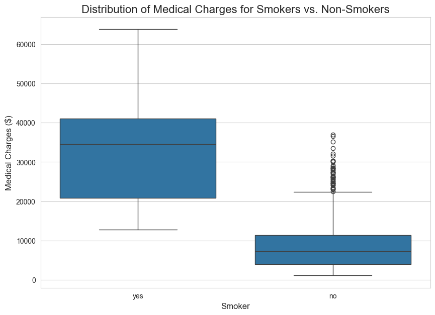
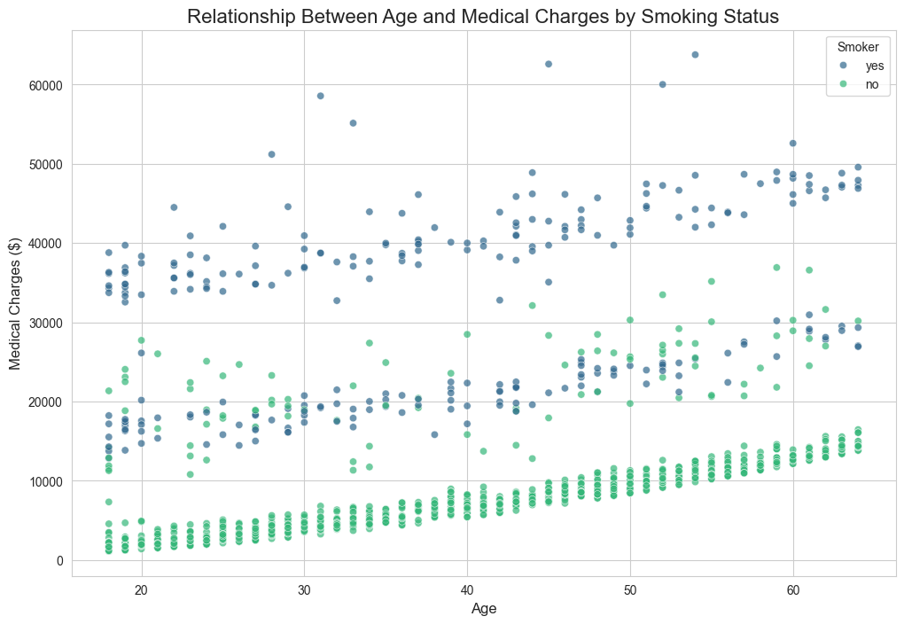

# Medical Insurance Cost Analysis

### An Exploratory Data Analysis Project


## Project Overview

This project is an Exploratory Data Analysis (EDA) of a medical insurance cost dataset. The primary goal is to understand the relationships between various patient attributes and their annual medical charges. By analyzing these factors, we can identify the key drivers of healthcare costs and build a foundation for a potential predictive model.

This analysis is performed using Python with popular data science libraries such as Pandas, Matplotlib, and Seaborn within a Jupyter Notebook environment.

## Key Questions and Objectives

The analysis aims to answer the following questions:
1.  How does smoking status affect medical charges?
2.  What is the relationship between age, BMI, and medical charges?
3.  Do factors like gender, number of children, or geographic region have a significant impact on costs?
4.  Are there combined effects, such as the relationship between BMI and charges being different for smokers and non-smokers?

## Dataset

The dataset used for this analysis is the "Medical Cost Personal Datasets" publicly available on Kaggle. It contains 1,338 observations with the following columns:

*   **`age`**: Age of the primary beneficiary.
*   **`sex`**: Gender of the insured (`female`, `male`).
*   **`bmi`**: Body mass index.
*   **`children`**: Number of children covered by health insurance.
*   **`smoker`**: Smoking status (`yes`, `no`).
*   **`region`**: The beneficiary's residential area in the US (`northeast`, `northwest`, `southeast`, `southwest`).
*   **`charges`**: Individual medical costs billed by health insurance.

## Technical Stack

*   **Language:** Python 3.13
*   **Libraries:**
    *   Pandas & NumPy for data manipulation and numerical operations.
    *   Matplotlib & Seaborn for data visualization.
    *   JupyterLab for interactive analysis and notebook development.
*   **Environment Management:** `uv`

## How to Run This Project

To reproduce this analysis, please follow these steps:

1.  **Clone the repository:**
    ```bash
    git clone https://github.com/YOUR_USERNAME/insurance-cost-analysis.git
    cd insurance-cost-analysis
    ```

2.  **Create and activate a virtual environment:**
    ```bash
    # Create the environment
    uv venv

    # Activate the environment
    # On macOS/Linux:
    source .venv/bin/activate
    # On Windows:
    .venv\Scripts\activate
    ```

3.  **Install the required packages:**
    (It is recommended to create a `requirements.txt` file using `uv pip freeze > requirements.txt` and then install from it)
    ```bash
    uv pip install -r requirements.txt
    ```

4.  **Launch JupyterLab:**
    ```bash
    jupyter lab
    ```
    Then, open the `insurance_cost_analysis.ipynb` notebook and run the cells.

## Key Findings & Insights

1.  **Smoking is the Strongest Predictor of High Costs:** Smokers have drastically higher medical charges, with an average cost nearly four times that of non-smokers (~$32,050 vs. ~$8,434).
2.  **Age is Positively Correlated with Charges:** As age increases, medical charges tend to rise steadily. The data shows three distinct cost groups that appear to be related to age.
3.  **High BMI is a Major Factor, Especially for Smokers:** There is a strong correlation between high BMI (>30) and significantly higher medical costs, particularly for individuals who also smoke. For non-smokers, the impact of BMI is much less pronounced.
4.  **Region Has Minimal Impact:** The beneficiary's region of residence does not appear to be a significant driver of medical costs.

## Visualizations Showcase

*(Here you can add some of the key visualizations you created. To do this, save your plots as image files (e.g., `.png`) in an `images` folder and embed them here.)*

**Example:**

*A boxplot showing the dramatic difference in the distribution of charges between smokers and non-smokers.*


*A scatter plot revealing a positive correlation between age and medical charges.*

## Possible Next Steps

*   **Predictive Modeling:** Build a machine learning model (e.g., Linear Regression, Gradient Boosting) to predict medical charges based on patient attributes.
*   **Feature Engineering:** Create new features, such as an "is_obese" category based on BMI, to potentially improve model accuracy.
*   **In-depth Statistical Analysis:** Perform hypothesis testing to statistically validate the observations made during the EDA.